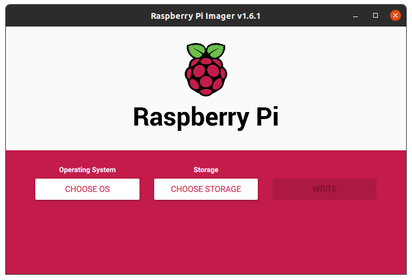
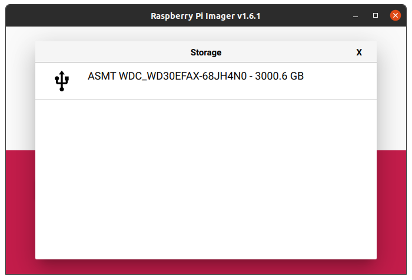
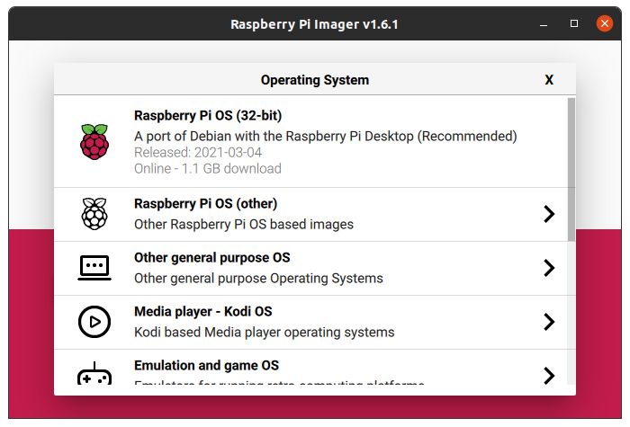
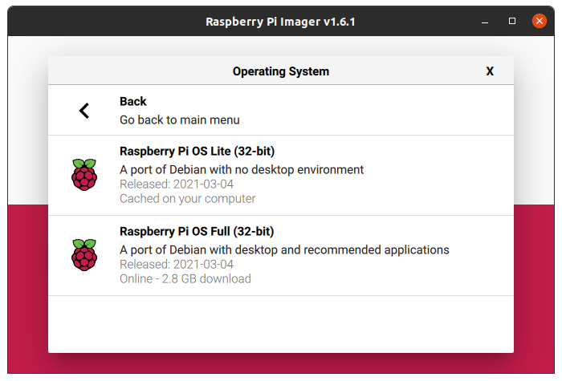
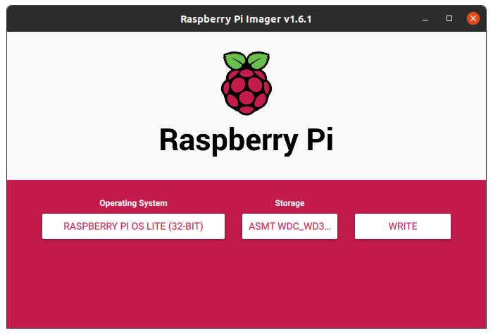
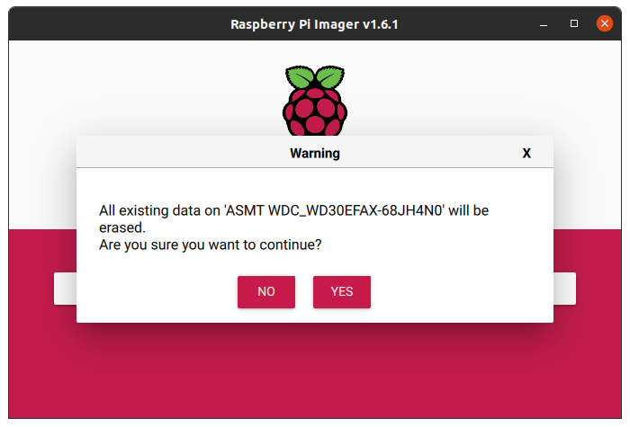
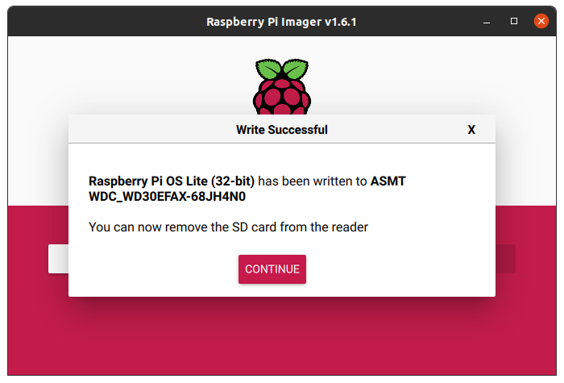

use 
https://www.raspberrypi.org/software/

click on "CHOOSE STORAGE"

click on "CHOOSE OS" then "Raspberry Pi OS (other)"

click on "Raspberry Pi OS Lite (32-bit)"

click on "CHOOSE STORAGE"

click on "CHOOSE STORAGE"

click on "CHOOSE STORAGE"

